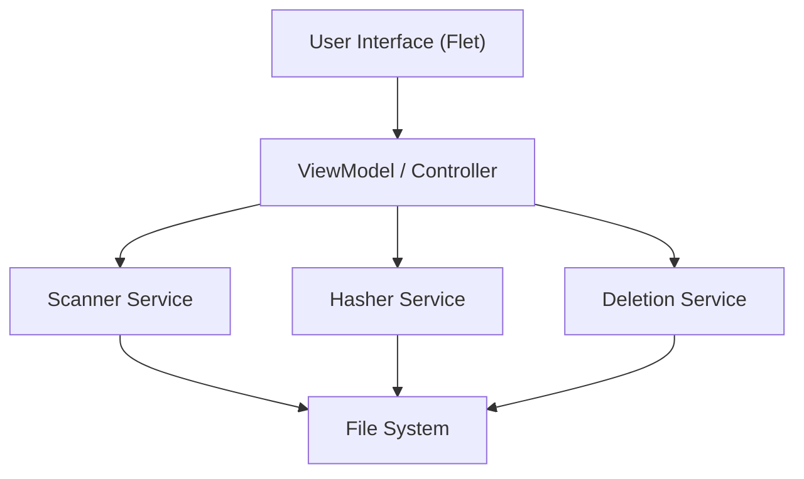

# 設計書

## 概要

macOS向けの重複ファイル検出・削除デスクトップアプリケーションの設計です。PythonとFletを使用して、モダンでレスポンシブなUIを実現し、ローカルおよびリモートストレージの効率的なスキャンを行います。

## ステアリングドキュメントとの整合性

### 技術標準 (tech.md)
- **言語**: Python 3.10+ を使用し、型ヒントを徹底します。
- **パッケージ管理**: `uv` を使用して依存関係を管理します。
- **UIフレームワーク**: Flet を採用し、"Rich Aesthetics"（リッチな美観）の要件を満たすモダンなUIを構築します。

### プロジェクト構造 (structure.md)
- `src/` ディレクトリ配下にソースコードを配置し、機能ごとにモジュール分割します。

## コード再利用分析

### 既存コンポーネントの活用
- プロジェクトは新規作成のため、既存コードの再利用はありません。
- Python標準ライブラリ（`pathlib`, `hashlib`, `concurrent.futures`）を最大限活用します。

## アーキテクチャ

MVVM (Model-View-ViewModel) パターンに類似したアーキテクチャを採用し、UIとロジックを分離します。



### モジュラー設計の原則
- **UI層**: 画面描画とユーザー入力のハンドリング。ロジックは持たない。
- **サービス層**: スキャン、ハッシュ計算、削除などのビジネスロジック。
- **データ層**: ファイルメタデータや重複グループのデータ構造。

## コンポーネントとインターフェース

### 1. Scanner Service (`scanner.py`)
- **目的**: 指定されたディレクトリを再帰的にスキャンし、対象（画像・動画）ファイルをリストアップする。
- **インターフェース**:
    - `scan_directories(paths: List[str]) -> Iterator[FileMeta]`
- **機能**:
    - 隠しファイル/フォルダの除外
    - 拡張子によるフィルタリング
    - エラーハンドリング（権限エラーなど）

### 2. Hasher Service (`hasher.py`)
- **目的**: ファイルのハッシュ値を計算して一意性を判定する。
- **インターフェース**:
    - `calculate_hash(path: str, partial: bool = True) -> str`
- **最適化**:
    - まずファイルサイズでフィルタリング
    - 次に先頭・末尾の数KBの部分ハッシュで比較
    - 候補が絞られた場合のみ全ハッシュを計算

### 3. Duplicate Detector (`detector.py`)
- **目的**: スキャン結果から重複グループを特定する。
- **インターフェース**:
    - `find_duplicates(files: List[FileMeta]) -> List[DuplicateGroup]`

### 4. UI Manager (`main.py`, `ui/`)
- **目的**: アプリケーションの画面遷移と表示。
- **画面**:
    - **Home**: スキャン対象フォルダの選択（ドラッグ＆ドロップ対応）
    - **Scanning**: プログレスバーと現在のステータス表示
    - **Results**: 重複グループのリスト表示、プレビュー、削除選択
    - **Cleanup**: 削除実行と結果レポート

## データモデル

### FileMeta
```python
@dataclass
class FileMeta:
    path: Path
    size: int
    modified_time: float
    partial_hash: Optional[str] = None
    full_hash: Optional[str] = None
    mime_type: Optional[str] = None
```

### DuplicateGroup
```python
@dataclass
class DuplicateGroup:
    hash_value: str
    size: int
    files: List[FileMeta]
    # ユーザーが保持することを選択したファイル（デフォルトは一番古いものなど）
    keep_file: Optional[FileMeta] = None
```

## エラーハンドリング

### エラーシナリオ
1. **アクセス権限エラー**:
    - **処理**: ログに記録し、そのファイルをスキップ。ユーザーにはスキャン完了後に「スキップされたファイル」として通知。
    - **ユーザー影響**: スキャンは止まらずに続行される。

2. **ネットワーク切断（NAS/クラウド）**:
    - **処理**: 再試行ロジック（リトライ）を実装。失敗が続く場合はエラーダイアログを表示してスキャンを中断。
    - **ユーザー影響**: スキャンが中断され、再接続を促される。

## テスト戦略

### 単体テスト (Unit Testing)
- `Scanner`: モックファイルシステムを使用して、正しくファイルをリストアップできるかテスト。
- `Hasher`: 既知のコンテンツに対して正しいハッシュが生成されるかテスト。
- `Detector`: 意図的に作成した重複ファイルセットで正しくグループ化されるかテスト。

### 統合テスト (Integration Testing)
- 実際のファイルシステム（一時ディレクトリ）を使用したスキャンから検出までの一連のフロー。

### E2Eテスト
- 手動テストを中心に、UIの応答性と実際のNAS/クラウドドライブでの動作を確認。
